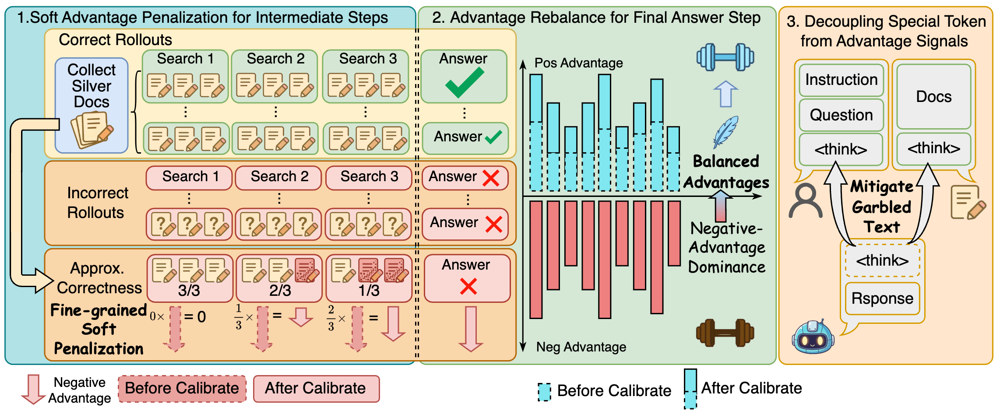

# Negative Advantage Is a Double-Edged Sword: Calibrating Advantage in GRPO for Deep Search

<p align="center">
  
</p>
<p align="center"><em>Overview of CalibAdv</em></p>

## Abstract

> Deep search agents can autonomously initiate multi-turn interactions with search engines, thereby exhibiting strong question-answering capabilities. Such performance critically relies on Group Relative Policy Optimization (GRPO) as its core training algorithm. However, GRPO still faces several challenges in deep search settings. First, there exists a substantial mismatch between the correctness of intermediate steps and the reward signal, causing numerous correct intermediate steps to be incorrectly penalized when the final answer is wrong. Second, training is highly unstable, often resulting in degradation of natural language ability or even catastrophic training collapse. Our analysis attributes these issues to coarse-grained advantage assignment and an imbalance between positive and negative advantages. To address these problems, we propose CalibAdv, an advantage calibration method specifically designed for deep search tasks. Specifically, CalibAdv leverages the correctness of intermediate steps to downscale excessive negative advantages at a fine-grained level. It then rebalances positive and negative advantages in the answer component. Extensive experiments across three models and seven benchmarks demonstrate that CalibAdv improves both model performance and training stability.

## 🔧 Environment Setup

We use two separate environments: one for **CalibAdv** and one for the **retriever**.

---

### 1️⃣ CalibAdv Environment

```bash
conda env create -f calibadv_environment.yml
conda activate calibadv
pip install -e .
```

---

### 2️⃣ Retriever Environment

```bash
conda create -n calibadv-retriever python=3.10
conda activate calibadv-retriever
pip install -r retriever_requirements.txt
```

---

## 🖥️ Tested Environment

* CalibAdv: Python 3.9.23
* Retriever: Python 3.10.18
* CUDA 12.1
* NVIDIA Driver ≥ 535
* PyTorch 2.4.0

All experiments were conducted on NVIDIA H20 GPUs.


## 🔍 Local Retrieval Setup

This section describes how to build and launch the local retrieval system.

---

### 1️⃣ Download Retrieval Index and Corpus

```bash
save_path=/path/to/save

python scripts/download.py --save_path $save_path

cat $save_path/part_* > $save_path/e5_Flat.index
gzip -d $save_path/wiki-18.jsonl.gz
```

After this step, you should have:

* `$save_path/e5_Flat.index`
* `$save_path/wiki-18.jsonl`

---

### 2️⃣ Download Retriever and Reranker Models

* Retriever: https://huggingface.co/intfloat/e5-base-v2
* Reranker: https://huggingface.co/cross-encoder/ms-marco-MiniLM-L12-v2

You can download them via HuggingFace:

```bash
huggingface-cli download intfloat/e5-base-v2 --local-dir /path/to/e5
huggingface-cli download cross-encoder/ms-marco-MiniLM-L12-v2 --local-dir /path/to/reranker
```

---

### 3️⃣ Launch Retrieval Server

```bash
file_path=/path/to/save

index_file=$file_path/e5_Flat.index
corpus_file=$file_path/wiki-18.jsonl

retriever_name=e5
retriever_path=/path/to/e5
reranker_path=/path/to/reranker

python search_r1/search/retrieval_rerank_server.py \
    --index_path $index_file \
    --corpus_path $corpus_file \
    --retrieval_topk 20 \
    --retriever_name $retriever_name \
    --retriever_model $retriever_path \
    --faiss_gpu \
    --reranking_topk 3 \
    --reranker_model $reranker_path
```

## 📊 Data Preparation and Training

---

### 1️⃣ Prepare Dataset

Run the following script to preprocess the data:

```bash
bash scripts/data_process_search.sh
```

---

### 2️⃣ Training

Start training with:

```bash
bash train_grpo.sh
```
