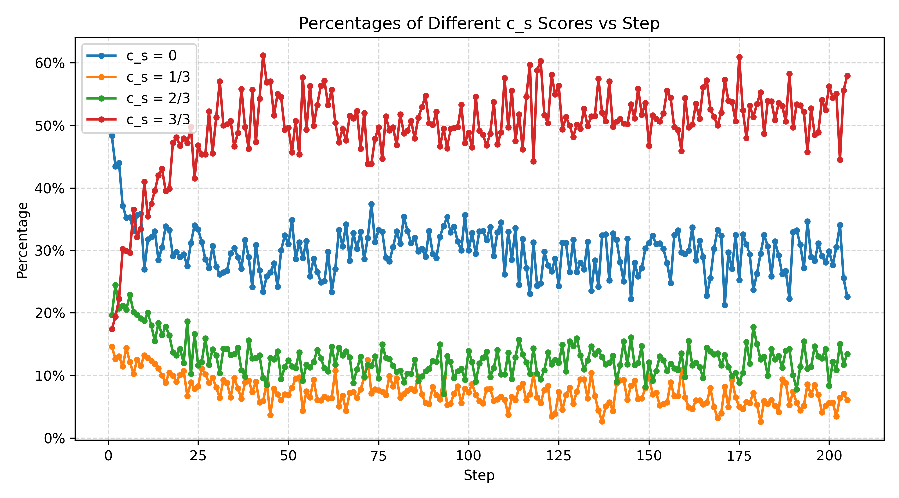
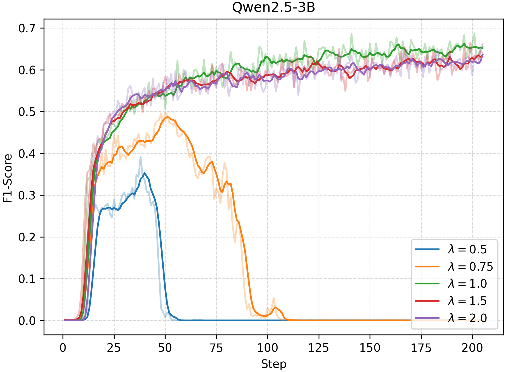
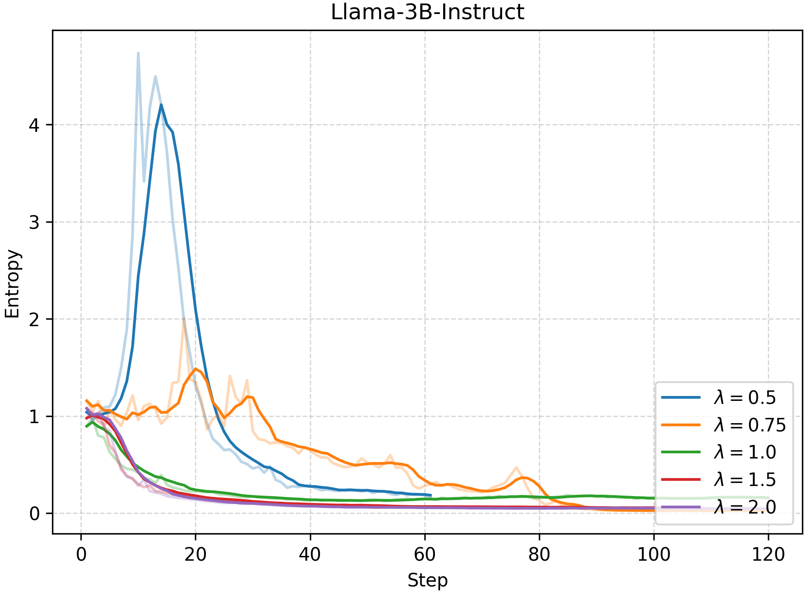

Negative Advantage Is a Double-Edged Sword: Calibrating Advantage in GRPO for Deep Search

*Figure 1. Number of mis-penalized queries, showing that CalibAdv is most effective in the early stage of training.*

*Figure 2. The number and ratio of mis-penalized queries among all queries, showing that CalibAdv is most effective in the early stage of training.*

*Figure 3. Fraction of groups in which all trajectories are incorrect, resulting in empty silver sets.*

*Figure 4. Distribution of silver set sizes.*

*Figure 5. Distribution of query correctness score values, showing that the correctness score does not degenerate into a binary decision.*

*Figure 6. Impact of the rebalance scaling coefficient λ on Qwen2.5-3B performance dynamics.*

*Figure 7. Impact of the rebalance scaling coefficient λ on Qwen2.5-3B entropy dynamics.*

*Figure 8. Impact of the rebalance scaling coefficient λ on Llama-3B-Instruct performance dynamics.*

*Figure 9. Impact of the rebalance scaling coefficient λ on Llama-3B-Instruct entropy dynamics.*

*Figure 10. Query correctness scores across all experiments, showing that Soft Penalty substantially improves search quality.*
