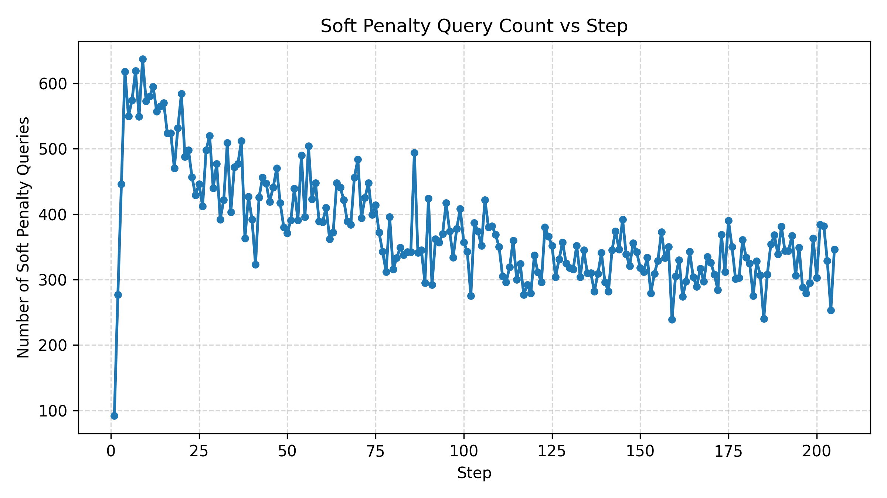
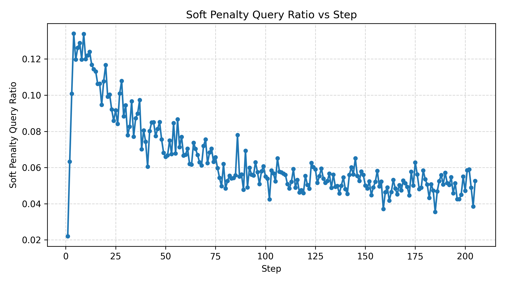
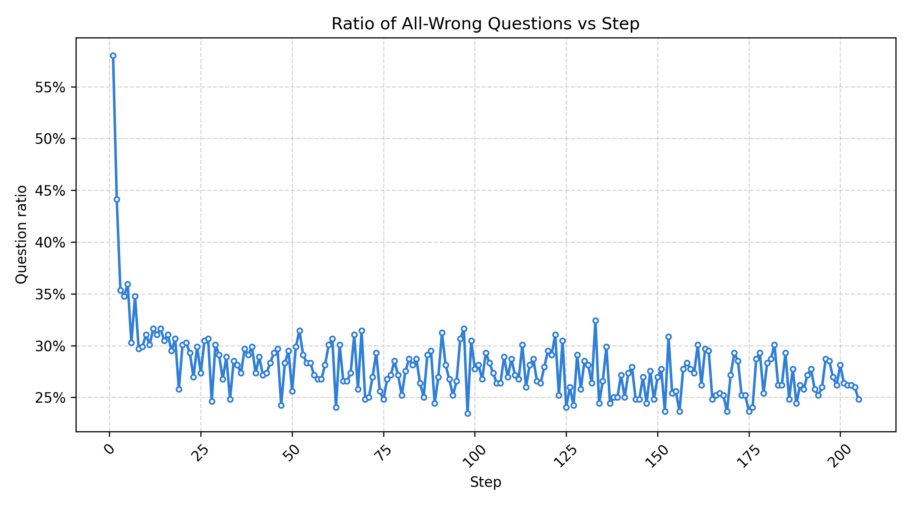
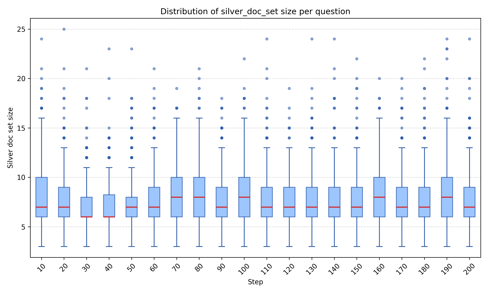
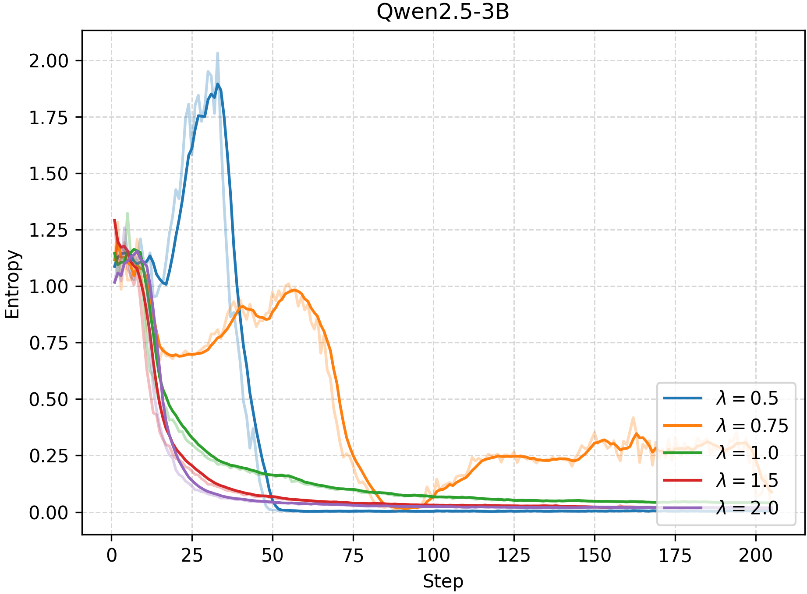
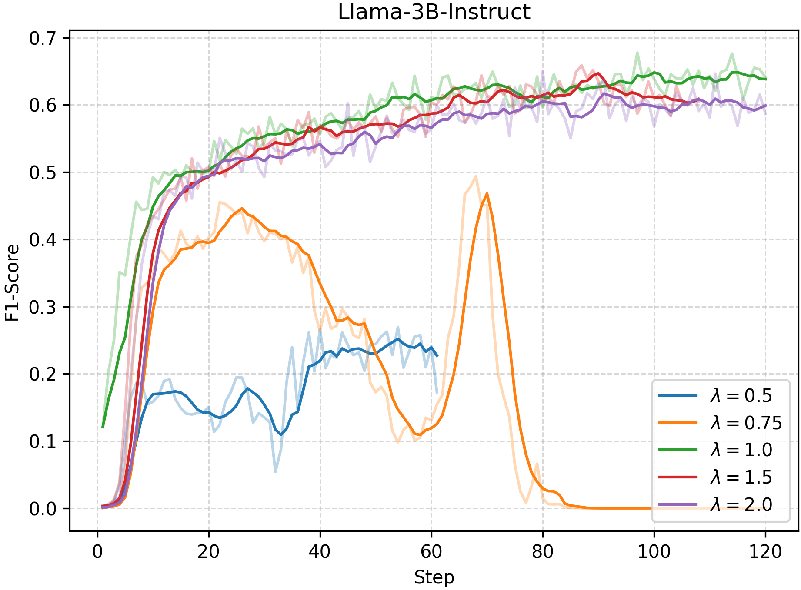
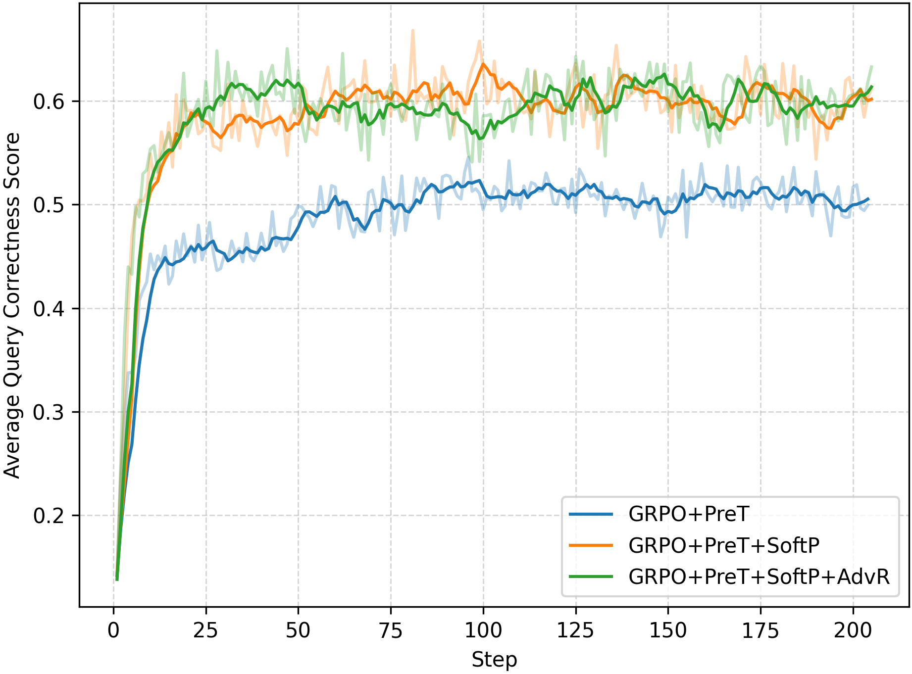

*Figure I. Number of mis-penalized queries, showing that CalibAdv is most effective in the early stage of training.*

*Figure II. The number and ratio of mis-penalized queries among all queries, showing that CalibAdv is most effective in the early stage of training.*

*Figure III. Fraction of groups in which all trajectories are incorrect, resulting in empty silver sets.*

*Figure IV. Distribution of silver set sizes.*

*Figure V. Distribution of query correctness score values, showing that the correctness score does not degenerate into a binary decision.*

*Figure VI. Impact of the rebalance scaling coefficient λ on Qwen2.5-3B performance dynamics.*

*Figure VII. Impact of the rebalance scaling coefficient λ on Qwen2.5-3B entropy dynamics.*

*Figure VIII. Impact of the rebalance scaling coefficient λ on Llama-3B-Instruct performance dynamics.*

*Figure IX. Impact of the rebalance scaling coefficient λ on Llama-3B-Instruct entropy dynamics.*

*Figure X. Query correctness scores across all experiments, showing that Soft Penalty substantially improves search quality.*
